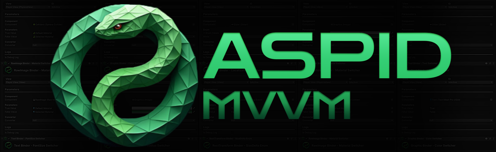

# Aspid.MVVM.Analyzers

**Aspid.MVVM.Analyzers** is a Roslyn-based code analysis and diagnostic tool designed to enhance development with
the [**Aspid.MVVM**](https://github.com/VPDPersonal/Aspid.MVVM/tree/main) framework. It provides real-time code analysis, diagnostics, and code fixes, improves code quality,
and prevents common pitfalls in projects.
